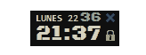
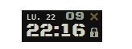

# MI RELOJ v0.2
hecho con tkinter y python esta es la segunda version que hago de este reloj, en la primera version tenia algunas cosas menos y se usaba widgets para los elementos

En esta segunda version uso Canvas de tkinter para posicionar de mejor manera los elementos que contiene, agregue la capacidad de transparencia, cambie los iconos y ademas de algunos atajos del teclado.
## vista previa

## Librerias usadas
 * pyglet     2.0.10
 
OTROS ARCHIVOS USADOS: el archivo de fuente:

`BlackOpsOne-Regular.ttf`
https://fonts.google.com/specimen/Black+Ops+One

obtiene la hora del sistema, tambien el dia
## Caracteristicas
* no tiene los marcos de la ventana
* se puede arrastrar para mover
* botones cerrar y mantener por encima de otras ventanas
* muestra hora y dia
* se puede ajustar la opacidad (transparencia)
* tiene algunos atajos de teclado

## Atajos de teclado
* flecha izquierda  -  para volverlo mas translucido
* flecha derecha  -  para regresarlo a la normalidad poco a poco
* espacio  -  para que retorne a la normalidad (sin transàrencia)
* Alt+x  -  para cerrar el programa